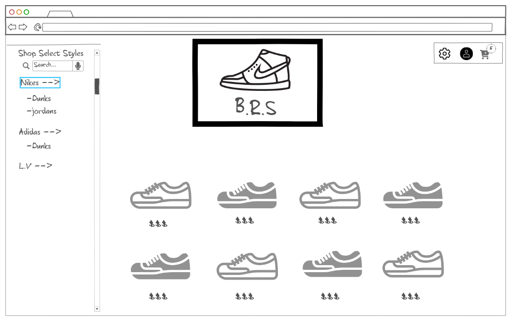

# B.R.S
## (Best Replica Sneakers)

## Description deliverable

### Elevator pitch

Buying fancy new sneakers from nike can cost you upwards of $200. With BRS you will be able to get all-inclusive access to a variety of replica sneakers costing half the price of resell markets. Our shoes are exact replicas of all your favorite brands and we challenge you to find the difference! If your not satisfied, its money back garunteed.

### Design

Here is depiction of our online market-place!
### Key features

- Secure login over HTTPS
- Ability to browse sneakers
- Display of choices
- Ability to select brands, colors and sizes

### Technologies

These are the technologies I will be using.

- **HTML** - Uses correct HTML structure for application. Three HTML pages that will be used for login and surfing for shoes and checkout. 
- **CSS** - Application styling that looks good on different screen sizes, uses good whitespace, color choice and contrast.
- **JavaScript** - Provides login, sneaker display, checkout pages.
- **Service** - Backend service with endpoints for:
  - login
  - shoe data
  - updating shoe prices
- **DB** - Store users, in database
- **Login** - Register and login users. Credentials securely stored in database. 
- **WebSocket** - As each user browses, shoe prices update when a user selects it. 
- **React** - Application ported to use the React web framework.

## HTML deliverable

For this deliverable I built out the structure of my application using HTML.

- **HTML pages** - I have 4 HTML page that represent the ability to login/welcome page, surf the top shoes, shop all shoes and an about page to learn about tahe origin of BRS.
- **Links** - The login/welcome page automatically links to all pages and all pages are linked together. 
- **Text** - Each page has a header and there is an about page that describes everything we do at BRS.
- **Images** - images of the shoes on all pages to view.
- **Login** - Input box and submit button for login.
- **Database** - The prices indicate real fluxuating market prices (this is tbd and has not been implemented yet)

## CSS deliverable

For this deliverable I will style the project

- **Header, footer, and main content body** - I styled my site to look monochrome and be easily navigated throught the header menu.
- **Navigation elements** - used the header and flex spacing to create a good looking menu at the top. 
- **Responsive to window resizing** - My app looks great on all window sizes and devices. It uses flex to modify well to everything. 
- **Application text content** - Consistent fonts, aesthetically pleasing to look at the site with the colors.
- **Application images** - correctly displays images under text and corrects width and height mistakes. 

## JavaScript deliverable

- **login** - When you press enter or the login button it takes you to the market-place.
- **cart** - Adding and removing shoes from the cart
- **shoe logic** - Adding and removing shoes button is independent per shoe and cannot remove a shoe that is not in cart.

## Service deliverable

For this deliverable I added backend endpoints that receives votes and returns the voting totals.

- **Backend service endpoints** - Placeholders for login that stores the current user on the server. Also updates the shoe pricing.

## DB deliverable

For this deliverable I will store shoe prices in the DB. 

## Login deliverable

For this deliverable I associate the votes with the logged in user.
- **User registration** - Creates a new account in the database.

## WebSocket deliverable

For this deliverable I will use webSocket to show updated prices 

## React deliverable

I don't know what this deliverable is yet but am excited to use it!
